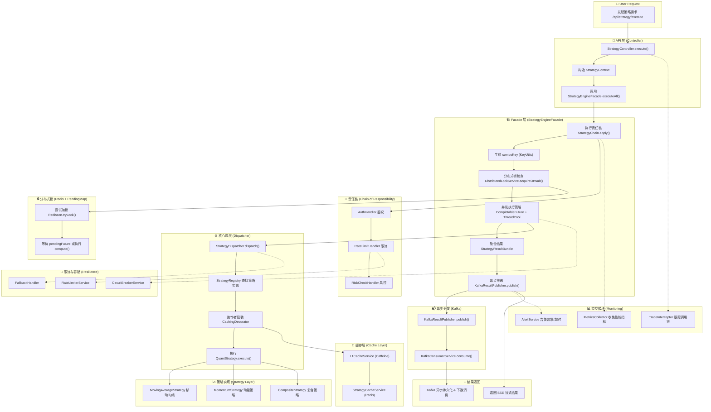

📁 项目结构总览

⚙️ 核心调用流程（按执行顺序）

🧩 使用到的设计模式说明

🧠 扩展性与集成点（例如责任链还能挂什么）

🧰 调用示例与典型执行路径图解

🚀 性能优化与高并发策略


# 📈 Quant Strategy Engine

**量化策略引擎模块（quant-strategy-engine）**

该模块是整个量化选股系统的**核心策略计算引擎**，负责根据用户请求动态组合并执行多种量化策略，支持异步并发执行、结果聚合、缓存优化、分布式锁合并、Kafka异步推送与限流熔断等高并发特性。

---

## 🧱 一、项目结构概览
```text
com.hao.strategyengine
├─ api
│ └─ controller # 控制层（接收外部请求）
│ ├─ StrategyController.java
│ └─ HealthController.java
│
├─ chain # 责任链模式（风控、限流、鉴权等）
│ ├─ AuthHandler.java
│ ├─ RateLimitHandler.java
│ ├─ RiskCheckHandler.java
│ └─ StrategyChain.java
│
├─ common # 公共工具与模型（跨模块复用）
│ ├─ cache # 一级缓存、Redis缓存
│ │ ├─ L1CacheService.java
│ │ └─ StrategyCacheService.java
│ ├─ config # 公共配置（线程池等）
│ │ └─ ThreadPoolConfig.java
│ ├─ model # 公共模型
│ │ ├─ core/StrategyContext.java
│ │ ├─ market/MarketData.java
│ │ ├─ request/StrategyRequest.java
│ │ ├─ response/StrategyResult*.java
│ │ └─ vo/StockBasicInfoQueryResultVO.java
│ └─ util/KeyUtils.java
│
├─ core # 核心引擎调度逻辑
│ ├─ dispatcher/StrategyDispatcher.java # 策略分发执行
│ ├─ facade/StrategyEngineFacade.java # 外观层（封装整个执行流程）
│ ├─ registry/StrategyRegistry.java # 策略注册中心
│ ├─ handler/ExceptionHandler.java # 异常捕获
│ └─ StrategyHandler.java # 通用接口
│
├─ integration # 外部系统集成
│ ├─ db/mapper/StrategyResultMapper.java
│ ├─ feign/DataCollectorClient.java
│ ├─ kafka/
│ │ ├─ KafkaConsumerConfig.java
│ │ ├─ KafkaConsumerService.java
│ │ └─ KafkaResultPublisher.java
│ ├─ nacos/properties/StrategyProperties.java
│ └─ redis/
│ ├─ RedisClient.java
│ └─ RedisConfig.java
│
├─ resilience # 容错与限流
│ ├─ CircuitBreakerService.java
│ ├─ FallbackHandler.java
│ └─ RateLimiterService.java
│
├─ service # 对外服务接口与实现
│ ├─ StrategyService.java
│ ├─ interf/
│ │ ├─ DragonTwoService.java
│ │ └─ StockStrategy.java
│ └─ impl/
│ └─ DragonTwoServiceImpl.java
│
├─ strategy # 策略算法层
│ ├─ QuantStrategy.java # 策略抽象接口
│ ├─ decorator/CachingDecorator.java # 装饰者模式
│ ├─ impl/
│ │ ├─ CompositeStrategy.java # 复合策略
│ │ ├─ MovingAverageStrategy.java # 移动均线
│ │ └─ MomentumStrategy.java # 动量策略
│ └─ lock/DistributedLockService.java # Redis分布式锁 + 请求合并
│
└─ monitoring # 🆕 新增：监控模块
├─ MetricsCollector.java
├─ AlertService.java
└─ TraceInterceptor.java
```
---
## ⚙️ 二、调用流程（执行顺序）

### 用户请求流程（从 Controller 到 Kafka）

1. **Controller 层**  
   → `StrategyController.execute(request)`
    - 接收用户请求（包含 userId、symbol、strategyIds）
    - 构建 `StrategyContext` 对象
    - 调用 `StrategyEngineFacade.executeAll(...)`

2. **Facade 层（外观模式）**  
   → `StrategyEngineFacade.executeAll()`
    - 触发前置责任链校验（`StrategyChain.apply()`）
    - 拼接组合 key（`KeyUtils.comboKey()`）
    - 通过 **DistributedLockService** 检查是否已有请求在执行：
        - 如果无人执行：获取 Redis 分布式锁，异步并发执行策略计算
        - 如果已有请求：等待 `CompletableFuture` 完成结果（Request Coalescing）

3. **Dispatcher 层**  
   → `StrategyDispatcher.dispatch(strategyId, context)`
    - 查找策略实现（`StrategyRegistry.get(id)`)
    - 用 `CachingDecorator` 包装策略（添加缓存逻辑）
    - 执行 `QuantStrategy.execute()` 具体算法

4. **策略层（Strategy）**
    - 具体实现类如：
        - `MovingAverageStrategy`
        - `MomentumStrategy`
        - `CompositeStrategy`（复合执行多个策略）
    - 每个策略执行后返回 `StrategyResult`

5. **结果聚合与异步推送**
    - 聚合结果为 `StrategyResultBundle`
    - 异步发送到 Kafka（`KafkaResultPublisher.publish()`）
    - Kafka 异步消费处理落库、监控、告警等

6. **监控链路**
    - `TraceInterceptor` 拦截全链路
    - `MetricsCollector` 统计执行耗时、命中率、锁等待时间
    - `AlertService` 推送超时与错误告警

---


## 🧩 三、使用到的设计模式

| 模式 | 位置 | 作用 |
|------|------|------|
| **策略模式 (Strategy)** | `QuantStrategy` + 各种 `impl` | 将每种算法独立封装，便于扩展 |
| **装饰者模式 (Decorator)** | `CachingDecorator` | 动态增强策略执行逻辑（缓存、限流、日志） |
| **责任链模式 (Chain of Responsibility)** | `StrategyChain` + 多个 Handler | 在执行前进行风控、鉴权、限流等可插拔逻辑 |
| **复合模式 (Composite)** | `CompositeStrategy` | 支持强相关策略组合执行 |
| **外观模式 (Facade)** | `StrategyEngineFacade` | 封装复杂执行逻辑，对外暴露统一接口 |
| **观察者模式 (Observer / PubSub)** | Kafka 集成模块 | 结果异步分发给不同消费者 |
| **模板方法模式 (Template)** | 各策略执行模板可复用 | 统一执行流程，子类只实现差异化逻辑 |
| **单例模式 (Singleton)** | Spring Bean管理的各个服务 | 保证线程安全与全局唯一性 |
| **分布式锁模式 (Locking + Coalescing)** | `DistributedLockService` | 合并相同策略组合请求，防止重复计算 |

---

## 🔗 四、责任链的扩展点（可热插拔）

当前责任链包括：

- `AuthHandler` — 鉴权校验
- `RateLimitHandler` — 限流保护
- `RiskCheckHandler` — 风控拦截

未来可**无侵入扩展**以下模块：

| 可新增Handler | 功能 |
|----------------|------|
| `GrayReleaseHandler` | 按用户分流策略灰度测试 |
| `TracingHandler` | 打点链路日志 / OpenTelemetry集成 |
| `FeatureToggleHandler` | 根据配置动态启停策略 |
| `PreCacheHandler` | 提前加载依赖数据以减少首次冷启动耗时 |
| `AuditHandler` | 记录用户策略调用审计日志 |

每个Handler通过Spring自动注入到`StrategyChain`，  
按`@Order`顺序执行，解耦而且可运行时扩展。

---


## 🔄 五、调用时序图（逻辑路径）

```text
用户请求
   │
   ▼
StrategyController.execute()
   │
   ▼
StrategyEngineFacade.executeAll()
   ├─▶ StrategyChain.apply()
   ├─▶ DistributedLockService.acquireOrWait()
   │      ├─▶ Redis Lock 尝试加锁
   │      ├─▶ 若锁空闲 → compute()
   │      └─▶ 若锁被占 → 等待 pending future
   ├─▶ 并发执行每个策略 (CompletableFuture + ThreadPool)
   │      ├─▶ StrategyDispatcher.dispatch()
   │      │     ├─▶ StrategyRegistry.get()
   │      │     ├─▶ new CachingDecorator(strategy)
   │      │     └─▶ QuantStrategy.execute()
   │      │            ├─▶ 获取行情 / DB数据
   │      │            └─▶ 返回 StrategyResult
   │      └─▶ 汇聚结果为 StrategyResultBundle
   ├─▶ KafkaResultPublisher.publish()
   └─▶ 返回 SSE/HTTP 响应给用户
```


## 📈 六、性能与高并发优化点

| 优化点                            | 技术方案                            | 效果                     |
| --------------------------------- | ----------------------------------- | ------------------------ |
| **分布式锁 + Request Coalescing** | Redisson + PendingFuture Map        | 防止重复计算热点组合请求 |
| **并发执行**                      | `CompletableFuture + 自定义线程池`  | 利用CPU核数并行计算策略  |
| **多级缓存**                      | Caffeine (L1) + Redis (L2)          | 减少外部依赖访问延迟     |
| **异步解耦**                      | Kafka 推送结果                      | 提高系统吞吐与解耦性     |
| **限流熔断**                      | Sentinel + RateLimiterService       | 防止过载与雪崩           |
| **监控追踪**                      | MetricsCollector + TraceInterceptor | 可观测性、报警能力       |
| **动态配置**                      | Nacos                               | 运行时调整线程池与参数   |

---


## 🧠 七、执行示例（逻辑顺序）

```java
@PostMapping("/execute")
public SseEmitter execute(@RequestBody StrategyRequest req) {
    // 1. 入口请求
    // 2. 构造上下文 -> StrategyContext
    // 3. 调用 StrategyEngineFacade.executeAll(...)
    // 4. Facade 内部执行：
    //     a. 责任链 -> 风控、限流
    //     b. 分布式锁 -> 防止重复计算
    //     c. 并发执行策略
    //     d. 缓存 + 结果聚合
    //     e. Kafka 异步发布
    // 5. SSE 返回结果到客户端
}
```


## 🧩 八、模块职责一览表

| 模块            | 职责                                    |
| --------------- | --------------------------------------- |
| **api**         | 暴露接口，接收用户请求                  |
| **core**        | 负责策略执行、锁协调、任务调度          |
| **strategy**    | 策略算法集合，可插拔、可复用            |
| **chain**       | 前置验证与风控责任链                    |
| **common**      | 公共模型、工具、配置                    |
| **integration** | 外部系统集成（Kafka/Redis/Feign/Nacos） |
| **resilience**  | 容错、限流、熔断机制                    |
| **monitoring**  | 性能监控、追踪与告警                    |
| **service**     | 对外业务封装层，协调不同模块            |


## 🧩 九、总结

该模块融合多种设计思想与实践：

- 使用 **策略 + 装饰者 + 责任链 + 复合模式** 提升扩展性；
- 结合 **分布式锁 + Kafka + Redis** 构建可横向扩展的高并发架构；
- 拥有完善的 **监控、熔断、限流与动态配置机制**；
- 是一个完整的、**工程化的策略引擎微服务模块**，可在高并发场景下稳定运行。

> ✅ **一句话总结：**
>  `quant-strategy-engine` 是一个可横向扩展、可观测、可演进的分布式策略执行引擎，
>  通过模块化与设计模式组合，实现高可用、高性能、高可维护性。


## 🪄 Mermaid 调用流程图





### 🧠 阅读说明（图解结构层次）

| 层级               | 主要职责                               | 关键类                                                       |
| ------------------ | -------------------------------------- | ------------------------------------------------------------ |
| **Controller 层**  | 接收 HTTP 请求，组装上下文             | `StrategyController`                                         |
| **Facade 层**      | 封装策略执行的完整流程                 | `StrategyEngineFacade`                                       |
| **Chain 层**       | 鉴权、风控、限流等前置责任链           | `AuthHandler`, `RateLimitHandler`, `RiskCheckHandler`        |
| **Core 层**        | 策略分发、注册中心、异常捕获           | `StrategyDispatcher`, `StrategyRegistry`                     |
| **Strategy 层**    | 各种算法实现                           | `MovingAverageStrategy`, `MomentumStrategy`, `CompositeStrategy` |
| **Cache 层**       | 多级缓存（L1+Caffeine，L2+Redis）      | `StrategyCacheService`, `L1CacheService`                     |
| **Lock 层**        | Redis 分布式锁 + Request Coalescing    | `DistributedLockService`                                     |
| **Integration 层** | 外部系统（Kafka、Redis、Nacos、Feign） | 对应子包                                                     |
| **Resilience 层**  | 限流、熔断、Fallback 处理              | `RateLimiterService`, `CircuitBreakerService`                |
| **Monitoring 层**  | 可观测性、Tracing、Metrics、告警       | `TraceInterceptor`, `MetricsCollector`, `AlertService`       |


